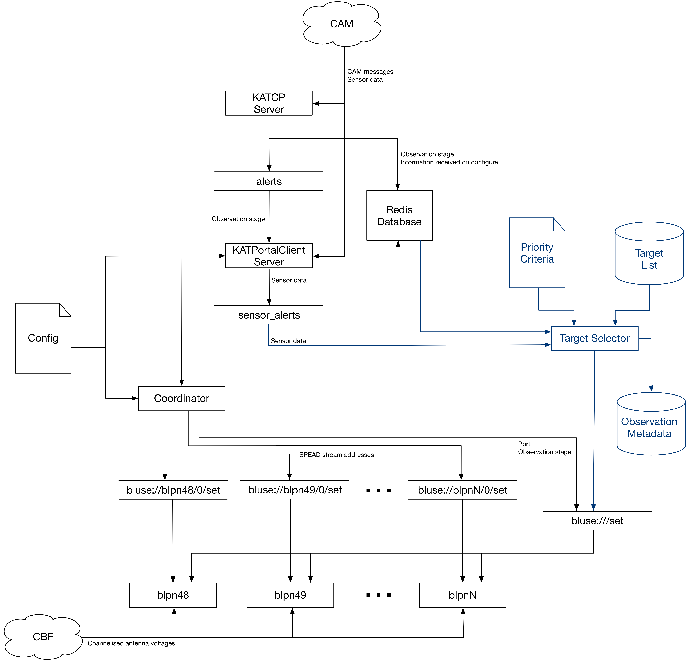

# meerkat-backend-interface

This repository contains the `KATCP Server`, `Katportal Client` and `Coordinator` components of the diagram below. Together, they extract all the observational metadata required for Breakthrough Listen's automated commensal observing program on MeerKAT. These data include:

* Addresses of SPEAD packet streams containing raw channelised antenna voltage data, to be subscribed to by our processing nodes for beamforming.
* Current target information.
* Information regarding the current stage and historical progress of an observation.
* Information regarding the current subarray configuration, including:
    * Specific antennas in the subarray
    * All other components in the subarray (e.g. CBF, SDP, other USEs)
    * Information about the band, center frequency, sampling rate, etc.
* Other comprehensive sensor data including the health of F-engine output streams. 

Once acquired, the `Coordinator` publishes the appropriate commands to the processing nodes via the Hashpipe-Redis gateway. 

* [Installation](docs/Installation.md)
* [KATCP Server](docs/KATCP_server.md)
* [KATPortal Server](docs/KATPortal_server.md)
* [Coordinator](docs/Coordinator.md)
* [Redis Documentation](docs/REDIS_DOCUMENTATION.md)

Other repositories that may be useful:

* [meerkat-reconfig](https://github.com/danielczech/meerkat-reconfig) - A tool to resend the most recent observation configuration information to specified hosts (processing nodes). Useful when debugging.

* [CAMcorder](https://github.com/danielczech/CAMcorder) - A tool to record and replay Redis commands in sequence; also useful when debugging. 

###  Diagram of the Breakthrough Listen MeerKAT Backend Interface

* CAM (Control and Monitoring): MeerKAT's control and monitoring system.
* blpn48 - blpnN: Breakthrough Listen's processing nodes (**b**reakthrough **l**isten **p**rocessing **n**ode) 
* CBF (Correlator-Beamformer): The MeerKAT component from which the F-engine UDP multicast streams are issued.  
* [Redis](https://redis.io/) Database: Stores key-value pairs of sensor information, and uses Redis pub/sub channels to disseminate information between components and other processing nodes. 
* The `Katportal Client` sends requests for additional metadata to `CAM`. 
* Target Selection and Beam Forming: This system (in a separate [repository](https://github.com/danielczech/meerkat_target_selector)) selects targets in the current field of view and sends them to the processing nodes. 

For redis key formatting and respective value descriptions, please see the [Redis Documentation](docs/REDIS_DOCUMENTATION.md)



## Usage
After starting redis, the processes can be started manually as given below. However, the intention is that they be run using `circusd` or similar.

```
(venv)$ python katcp_start.py --ip <fixed localhost ip address> --port <port> 
```

```
(venv)$ python katportal_start.py --config <config file>
```

```
(venv)$ python coordinator.py --config <config file> --triggermode <trigger mode>
```

### Current limitations/considerations:

* Currently, `katportal_start.py` does not shut down in a thread-safe way. `katcp_start.py` manages to do this, but it uses a complex mechanism that I don't understand. 

* Tasks are marked in the code with a `TODO` keyword.

* Will this same software be used on the SKA? (approx. 2022?)

## References

1. [SETI on MeerKAT Project Proposal, Siemion et al.](https://www.overleaf.com/5968578fnxfyc#/19819904/)
2. [katcp-python GitHub repository](https://github.com/ska-sa/katcp-python)
3. [katportalclient GitHub repository](https://github.com/ska-sa/katportalclient)
4. [MeerKAT ICD](https://docs.google.com/document/d/19GAZYT5OI1CLqoWU8Q2urBUYyTVfvWktsH4yTegrF_0/edit#)
5. [TRAPUM-CAM Interface](https://github.com/ewanbarr/reynard/tree/refactor)
6. [Swim Lane Diagram](https://docs.google.com/spreadsheets/d/1U9Un2jd3GsgTeaJ96GhQPXckZkG_TdRd0DCsaxFeX3Q/edit#gid=0)
7. [Katportal Docs](https://docs.google.com/document/d/1BD22ZwaVwHiB6vxc0ryP9vUXnFAsTbmD8K2oBPRPWCo/edit). 
